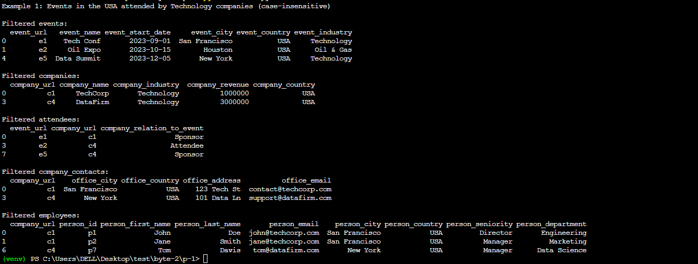
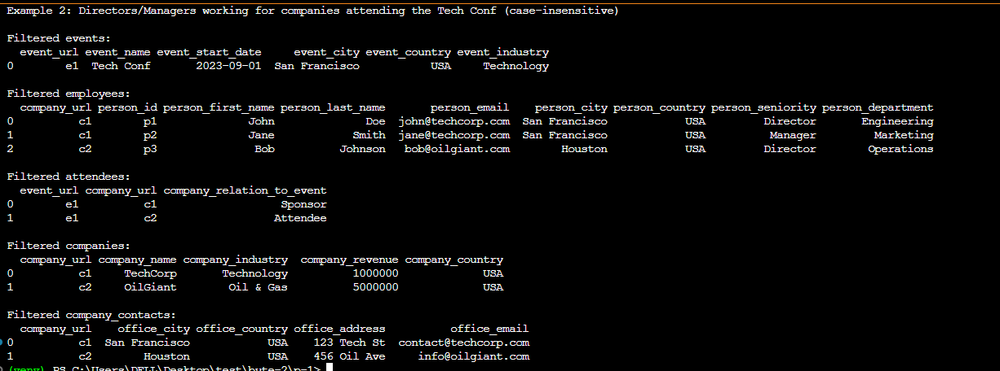
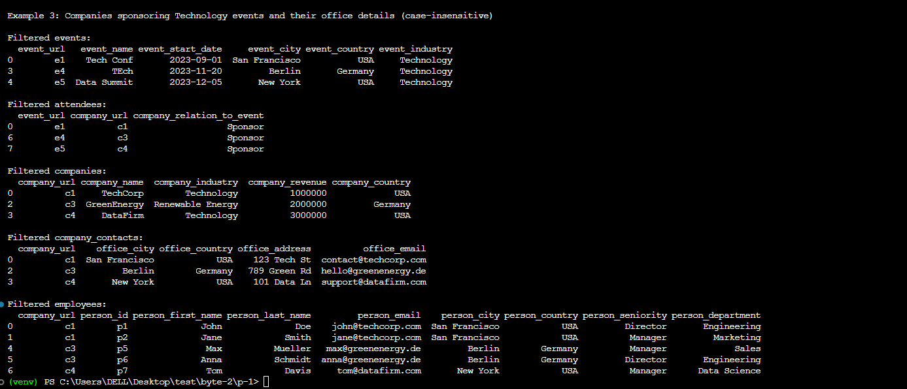

## P1: Two approaches to implement this filtering functionality

### 1. Merge operations to combine based on their relationships (Preferred) 
#### Pros: 
- Works with the existing DataFrame structure, easier to implement and understand.
- Flexible to work wrt to the number of dataframes leveraging the pandas library.
#### Cons: 
- May be less efficient for very large datasets or complex queries.
- Requires careful handling

### 2. Graph-based approach:
Represent the data as a graph where events, companies, and people are nodes, and their relationships are edges. This can be done by using a graph database like neo4j or in-memory graph structure to store and query the data. Implementing filtering by traversing the graph based on the specified conditions.
#### Pros: 
- Naturally represents the interconnected nature of the data, efficient for complex queries.
#### Cons: 
- May require additional libraries or databases, potentially more complex to set up and maintain
- For simpler usecases it won't be that necessary as its complex to set up and may grow larger for large datasets.

## Overview

* All specified dataframes are included: events, attendees, companies, company_contacts, and employees.
* Each dataframe has the columns you specified.
* The relationships between the dataframes are defined in the `relationships` dictionary in the `DataFrameFilter` class.
* The sample data in the `__main__` section demonstrates the use of all these dataframes and their columns.
* Three example filtering scenarios are provided to show how the filter works across multiple dataframes and conditions.

## Examples
```python

# Example 1: Case-insensitive filtering for events in the USA attended by companies in the Technology industry
    conditions1 = {
        'events': {'event_country': 'usa'},
        'companies': {'company_industry': 'TECHNOLOGY'}
    }


    # Example 2: Case-insensitive filtering for employees who are Directors or Managers and work for companies attending the Tech Conf
    conditions2 = {
        'events': {'event_name': 'TECH CONF'},
        'employees': {'person_seniority': ['director','manager']}
    }

    # # Example 3: Case-insensitive filtering for companies sponsoring events in the Technology industry, along with their office details
    conditions3 = {
        'events': {'event_industry': 'technology'},
        'attendees': {'company_relation_to_event': 'SPONSOR'}
    }

```

### Outputs
#### Case-insensitive filtering for events in the USA attended by companies in the Technology industry


<hr />

#### Case-insensitive filtering for employees who are Directors or Managers and work for companies attending the Tech Conf


<hr />

#### Case-insensitive filtering for companies sponsoring events in the Technology industry, along with their office details



### Design

- Case-insensitive filtering
- SOLID Principles
- Design Patterns
- Code Organization

### Features & Code

1. Filtering by event_name:
   When we filter by `event_name`, the code will return only the companies linked to that event and the people linked to those companies. This is achieved through the relationship propagation in the `filter` method.
2. Filtering by person_seniority:
   When we filter by `person_seniority`, the code will return only the companies that have people with that seniority, and only the events attended by those companies. Again, this is handled by the relationship propagation.
3. Filtering by multiple conditions (e.g., event_city and person_seniority):
   The code can handle multiple conditions across different DataFrames. It will return only the events, companies, and people that meet all the specified conditions and their related entities.
4. Extensibility for additional DataFrames:
   The implementation is designed to work with an arbitrary number of DataFrames. To add a new DataFrame (e.g., past employments), you would simply:
   1. Add the new DataFrame to the `dataframes` dictionary when initializing the `DataFrameFilter`.
   2. Update the `relationships`  in the `get_relationships` method to include the new relationships.

For example, if we added a `past_employments` DataFrame:

```bash
past_employments_df = pd.DataFrame({
    'person_id': ['p1', 'p2', 'p3', 'p4'],
    'previous_company_url': ['c2', 'c3', 'c1', 'c4']
}) # in create_sample_dataframes method

dataframes['past_employments'] = past_employments_df

# Update the relationships
self.relationships['past_employments'] = {'employees': 'person_id'}
self.relationships['employees']['past_employments'] = 'person_id'

```

