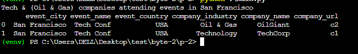
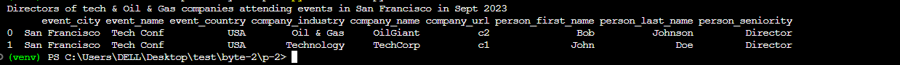
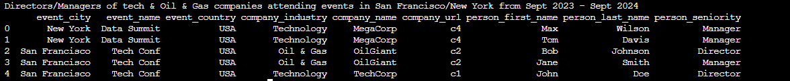

## P2: PostgreSQL Tables Filtering Function

Load the db data by running df_db_load.py and attributes_db_load.py. Don't forget to run the postgres isntance in docker/locally

## Examples

```python
    # Example 1: Tech  & (Oil & Gas) companies attending events in San Francisco
    print("""Tech & (Oil & Gas) companies attending events in San Francisco""")
    filter_arguments = [
        ['event_city', 'includes', ['San Francisco']],
        ['company_industry', 'includes', ['Technology', 'Oil & Gas']],
    ]
    output_columns = ['event_city', 'event_name', 'event_country', 'company_industry', 'company_name', 'company_url']

    # Example 2: Directors of tech & Oil & Gas companies attending events in San Francisco in Sept 2023
    print("""Directors of tech & Oil & Gas companies attending events in San Francisco in Sept 2023""")
    filter_arguments = [
        ['event_city', 'includes', ['San Francisco']],
        ['event_start_date', 'less-than-equal-to', '2023-09-30'],
        ['event_start_date', 'greater-than-equal-to', '2023-09-01'],
        ['company_industry', 'includes', ['Technology', 'Oil & Gas']],
        ['person_seniority', 'includes', ['Director']],
    ]
    output_columns = ['event_city', 'event_name', 'event_country', 'company_industry', 'company_name', 'company_url', 'person_first_name', 'person_last_name', 'person_seniority']

    # Example 3: Directors/Managers of tech & Oil & Gas companies attending events in San Francisco/New York from Sept 2023 - Sept 2024
    print("""Directors/Managers of tech & Oil & Gas companies attending events in San Francisco/New York from Sept 2023 - Sept 2024""")
    filter_arguments = [
        ['event_city', 'includes', ['San Francisco','New York']],
        ['event_start_date', 'less-than-equal-to', '2024-09-30'],
        ['event_start_date', 'greater-than-equal-to', '2023-09-01'],
        ['company_industry', 'includes', ['Technology', 'Oil & Gas']],
        ['person_seniority', 'includes', ['Director','Manager']],
    ]
    output_columns = ['event_city', 'event_name', 'event_country', 'company_industry', 'company_name', 'company_url', 'person_first_name', 'person_last_name', 'person_seniority']

```

### Outputs

#### Tech & (Oil & Gas) companies attending events in San Francisco



<hr />

#### Directors of tech & Oil & Gas companies attending events in San Francisco in Sept 2023



<hr />

#### Directors/Managers of tech & Oil & Gas companies attending events in San Francisco/New York from Sept 2023 - Sept 2024



### Design

- SOLID Principles
- Design Patterns
- Code Organization

### Features & Code

1. System Design

- QueryBuilder: Responsible for building query parts
- QueryExecutor: Responsible for executing queries
- QueryGenerator: Responsible for generating the full query
- DataQueryService: Orchestrates the query generation and execution

2. It's general enough to handle conditions on any attributes present in the databases.
3. It supports the required condition types: 'includes', 'greater-than-equal-to', and 'less-than-equal-to'.
4. It uses nested queries (CTEs) to reduce complexity and improve readability.
5. It only uses necessary joins based on the required tables for the query.
6. It breaks down the conditions into steps of retrieval and combines them to get the derived columns.
